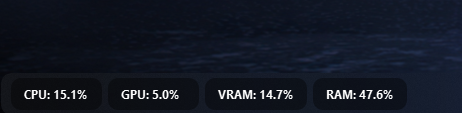

# System Monitor Widget Py 🐍

[](https://github.com/Xardax88/SystemMonitor/releases)

[](https://opensource.org/license/mit/)
[](https://www.python.org/downloads/)
[](https://pypi.org/project/PyQt6/)
[](https://github.com/psf/black)

Un widget flotante para Windows programado en Python, que muestra el uso de CPU, GPU, VRAM y RAM en tiempo real, siempre visible y con fondo translúcido/acrílico.

> [!IMPORTANT]  
> Actualmente la aplicación solo funciona con placas de video NVIDIA, ya que utiliza la librería GPUtil para obtener información de la GPU.
---

## Características



- Muestra estadísticas de CPU, GPU, VRAM y RAM.
- Siempre visible.
- Fondo translúcido/acrílico (Fluent Design, solo Windows 10/11).
- Se puede mover y bloquear en pantalla.
- Control desde el icono de la bandeja del sistema.

## Requisitos

- Python 3.8+
- PyQt6
- psutil
- GPUtil

## Instalación

1.  **Clonar el repositorio (opcional):**

    Si desea modificar el código fuente, clone el repositorio de GitHub:

    ```bash
    git clone https://github.com/Xardax88/SystemMonitor.git
    cd SystemMonitor
    ```

2.  **Crear un entorno virtual (recomendado):**

    Es altamente recomendado crear un entorno virtual para aislar las dependencias del proyecto del resto de su sistema Python.

    *   Abra una terminal o símbolo del sistema.
    *   Navegue al directorio del proyecto (si clonó el repositorio).
    *   Cree un entorno virtual usando `venv`:

        ```bash
        python -m venv .venv
        ```

        *   En algunos sistemas, puede que necesite usar `python3` en lugar de `python`.


3.  **Activar el entorno virtual:**

    Debe activar el entorno virtual para que Python utilice las dependencias instaladas dentro de él.

    *   **Windows:**

        ```bash
        .venv\Scripts\activate
        ```


4.  **Instalar las dependencias:**

    Utilice `pip` para instalar las dependencias necesarias del archivo `requirements.txt`:

    ```bash
    pip install -r requirements.txt
    ```

5.  **Ejecutar el System Monitor Widget:**

    Una vez que las dependencias estén instaladas, puede ejecutar el script principal:

    ```bash
    python main.py
    ```
   
## Uso

Ejecuta el script principal:

*   **Windows:**
    ```bash
      .venv\Scripts\activate
      python main.py
    ```

El widget aparecerá en la esquina inferior izquierda. Usa el icono de la bandeja para mostrar/ocultar, bloquear posición o salir.

## Notas

- El widget intenta estar siempre visible sobre la barra de tareas.
- El fondo translúcido/acrílico solo funciona en Windows 10/11.
- **Limitaciones**: Actualmente solo funciona con tarjetas NVIDIA.

---

## Licencia
Este proyecto está licenciado bajo la Licencia MIT. Consulta el archivo [LICENSE](LICENSE) para más detalles.

## Autor

Paragoni Maximiliano (Xardax88)
    